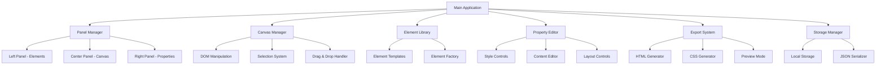

# Design Document

## Overview

The Visual Web Builder is a single-page application built with pure HTML, CSS, and JavaScript that provides a drag-and-drop interface for creating websites. The application uses a three-panel layout with real-time visual feedback and code generation capabilities. The architecture emphasizes modularity, performance, and maintainability while avoiding external dependencies.

## Architecture

### High-Level Architecture



### Core Components

1. **Application Controller**: Main orchestrator managing component communication
2. **Panel System**: Manages the three-panel layout and responsive behavior
3. **Drag & Drop Engine**: Handles all drag-and-drop interactions using HTML5 APIs
4. **Canvas Manager**: Manages the visual canvas and element rendering
5. **Element System**: Defines and manages draggable HTML elements
6. **Property Editor**: Provides real-time style and content editing
7. **Export Engine**: Generates clean HTML/CSS code
8. **Storage System**: Handles project persistence

## Components and Interfaces

### 1. Application Controller

```javascript
class VisualWebBuilder {
    constructor()
    init()
    setupEventListeners()
    handleGlobalEvents()
}
```

**Responsibilities:**
- Initialize all subsystems
- Coordinate communication between components
- Handle global application state
- Manage application lifecycle

### 2. Panel Manager

```javascript
class PanelManager {
    constructor(container)
    createLayout()
    resizePanels()
    togglePanel(panelId)
}
```

**Responsibilities:**
- Create and manage the three-panel layout
- Handle panel resizing and responsive behavior
- Manage panel visibility and state

### 3. Drag & Drop Engine

```javascript
class DragDropEngine {
    constructor(canvas, elementLibrary)
    initializeDragSources()
    handleDragStart(event)
    handleDragOver(event)
    handleDrop(event)
    createDropZones()
    showDropIndicators()
}
```

**Responsibilities:**
- Implement HTML5 drag and drop functionality
- Manage drag sources and drop targets
- Provide visual feedback during drag operations
- Handle element insertion and positioning

### 4. Canvas Manager

```javascript
class CanvasManager {
    constructor(canvasElement)
    createElement(elementType, properties)
    selectElement(element)
    deleteElement(element)
    updateElement(element, properties)
    getCanvasHTML()
    clearCanvas()
}
```

**Responsibilities:**
- Manage the visual canvas and its contents
- Handle element selection and highlighting
- Maintain element hierarchy and relationships
- Provide canvas manipulation methods

### 5. Element Library

```javascript
class ElementLibrary {
    constructor()
    getAvailableElements()
    createElement(type, config)
    getElementTemplate(type)
    registerCustomElement(type, template)
}
```

**Element Types:**
- Container elements: div, section, article, header, footer
- Text elements: h1-h6, p, span, a
- Form elements: input, textarea, button, select, label
- Media elements: img, video, audio
- Layout elements: nav, aside, main

### 6. Property Editor

```javascript
class PropertyEditor {
    constructor(rightPanel)
    showElementProperties(element)
    createStyleControls(element)
    createContentControls(element)
    updateElementStyle(element, property, value)
    updateElementContent(element, content)
}
```

**Property Categories:**
- Layout: display, position, width, height, margin, padding
- Typography: font-family, font-size, color, text-align, line-height
- Background: background-color, background-image, background-size
- Border: border-width, border-style, border-color, border-radius
- Effects: box-shadow, opacity, transform

### 7. Export Engine

```javascript
class ExportEngine {
    constructor(canvasManager)
    generateHTML()
    generateCSS()
    createPreview()
    downloadFiles()
    copyToClipboard()
}
```

**Responsibilities:**
- Generate clean, semantic HTML
- Extract and organize CSS styles
- Create downloadable files
- Provide preview functionality

### 8. Storage Manager

```javascript
class StorageManager {
    constructor()
    saveProject(projectData)
    loadProject(projectId)
    getProjectList()
    deleteProject(projectId)
    autoSave(projectData)
}
```

## Data Models

### Element Model

```javascript
const ElementModel = {
    id: 'unique-element-id',
    type: 'div|p|h1|img|button|etc',
    content: 'text content or innerHTML',
    styles: {
        width: '100px',
        height: '50px',
        backgroundColor: '#ffffff',
        // ... other CSS properties
    },
    attributes: {
        class: 'custom-class',
        id: 'custom-id',
        // ... other HTML attributes
    },
    children: [], // Array of child element IDs
    parent: 'parent-element-id'
}
```

### Project Model

```javascript
const ProjectModel = {
    id: 'project-unique-id',
    name: 'Project Name',
    created: '2024-01-01T00:00:00Z',
    modified: '2024-01-01T00:00:00Z',
    elements: {}, // Object map of element IDs to ElementModel
    rootElements: [], // Array of top-level element IDs
    canvasSettings: {
        width: '1200px',
        backgroundColor: '#ffffff',
        viewport: 'desktop'
    },
    customCSS: '' // Additional custom CSS
}
```

## Error Handling

### Drag & Drop Error Handling

1. **Invalid Drop Targets**: Prevent dropping elements in invalid locations
2. **Browser Compatibility**: Fallback for browsers with limited drag/drop support
3. **Touch Device Support**: Alternative interaction methods for mobile devices

### Canvas Error Handling

1. **Element Corruption**: Validate element data before rendering
2. **Circular References**: Prevent infinite loops in parent-child relationships
3. **Memory Management**: Clean up event listeners and references

### Storage Error Handling

1. **LocalStorage Limits**: Handle quota exceeded errors gracefully
2. **Data Corruption**: Validate stored data before loading
3. **Version Compatibility**: Handle projects created with different versions

### Export Error Handling

1. **Invalid HTML**: Sanitize and validate generated markup
2. **CSS Conflicts**: Resolve naming conflicts and invalid properties
3. **Large Projects**: Handle performance issues with complex projects

## Testing Strategy

### Unit Testing

1. **Component Testing**: Test each class and its methods independently
2. **Utility Functions**: Test helper functions and data transformations
3. **Model Validation**: Test data model creation and validation

### Integration Testing

1. **Drag & Drop Workflows**: Test complete drag-and-drop scenarios
2. **Property Editing**: Test style application and real-time updates
3. **Export Functionality**: Test HTML/CSS generation accuracy

### User Interface Testing

1. **Cross-Browser Testing**: Test in Chrome, Firefox, Safari, Edge
2. **Responsive Testing**: Test panel layout at different screen sizes
3. **Accessibility Testing**: Test keyboard navigation and screen reader support

### Performance Testing

1. **Large Projects**: Test with projects containing many elements
2. **Real-time Updates**: Test performance of live style updates
3. **Memory Usage**: Monitor for memory leaks during extended use

## Implementation Considerations

### Browser Compatibility

- Use modern JavaScript features with appropriate fallbacks
- Implement touch event handling for mobile devices
- Test drag-and-drop functionality across browsers

### Performance Optimization

- Implement virtual scrolling for large element libraries
- Use requestAnimationFrame for smooth animations
- Debounce property updates to prevent excessive DOM manipulation

### Accessibility

- Provide keyboard alternatives to drag-and-drop
- Implement proper ARIA labels and roles
- Ensure sufficient color contrast in the interface

### Security

- Sanitize user-generated content to prevent XSS
- Validate all input data before processing
- Implement safe HTML generation practices